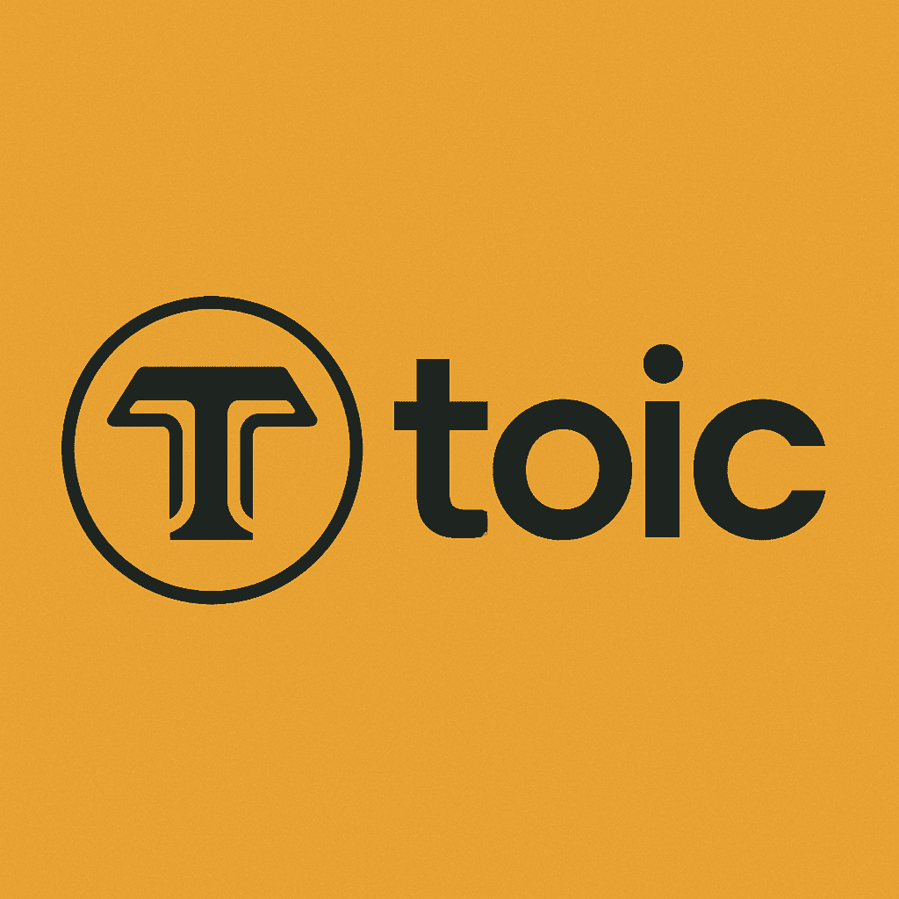

<div align="center">
  <h1>TOIC: Decentralized Storytelling Platform + Tokenomics</h1>
  <p>
    <strong>
TOIC is a decentralized platform for writers and readers, enabling creators to publish, share, and monetize their stories while maintaining full ownership of their content. Built on the Internet Computer Protocol (ICP), TOIC leverages blockchain technology to provide a censorship-resistant, immutable, and user-centric experience.</strong>
  </p>
  <p>


</p>
</div>

## Key Features

### For Writers

- **Rich Text Editor with Markdown Support**  
  Compose stories using a powerful, auto-saving editor that supports markdown formatting for seamless writing.

- **Decentralized Publishing**  
  Publish directly to the Internet Computer with full data ownership. Your work is immutable, censorship-resistant, and always accessible.

- **AI-Powered Writing Tools**  
  Unlock premium AI features like content expansion and automatic description generation by staking tokens.

- **Monetization Without Middlemen**  
  Earn tokens through tips and referrals. The more readers engage with your stories, the more you earn — no ads, no intermediaries.

### For Readers

- **Personalized Feed & Recommender System**  
  Discover relevant stories through a smart content recommendation engine tailored to your interests.

- **Support Your Favorite Creators**  
  Tip or like stories using tokens to directly support the authors you love.

### For Everyone

- **Internet Identity Authentication**  
  Secure, decentralized login powered by Internet Identity ensures privacy and security.

- **ICRC-2 Token Integration**  
  Built on the ICP blockchain using a fungible token standard for seamless transactions.

- **Airdrop with Referral Support**  
  New users receive token rewards via referral codes upon account creation.

## Technical Highlights

- **Blockchain-Based Architecture**  
  TOIC uses ICP Rust-based stable structures for persistence and ownership, ensuring decentralized and reliable data storage.

- **Smart Contracts**  
  The backend is powered by canisters (smart contracts) written in Rust, enabling secure and efficient operations.

- **Frontend**  
  Built with modern web technologies like React 19, Zustand for state management, and TailwindCSS for styling.

- **AI Integration using llama model**  
  Leverages AI models for writing assistance, including paragraph expansion and story description generation.

- **Token Economy**  
  Supports ICRC-2 tokens for minting, tipping, staking, and unlocking premium features.

- **Binary Tree Indexing Strategy**  
  Structure are stored on-chain with indexing support using Binary Tree based data structure

## Project Structure

The project is divided into two main components: the backend and the frontend.

### Backend (`src/toic_backend`)

- **`services/`**: Contains the core business logic for handling drafts, stories, users, and token operations.
- **`repositories/`**: Implements data persistence using stable structures like binary trees for indexing and storage.
- **`token/`**: Manages token-related functionalities, including minting, staking, and transfers, and all ICRC-2 standards.
- **`types.rs`**: Defines core data structures like `Story`, `Draft`, and `User`.
- **`lib.rs`**: Entry point for the backend canister, exposing APIs for frontend interaction.

### Frontend (`src/toic_frontend`)

- **`src/pages/`**: Contains React components for different pages like `Landing`, `Story Editor`, and `Profile`.
- **`src/store/`**: Manages application state using Zustand for drafts, stories, and user data.
- **`src/components/`**: Reusable UI components like buttons, modals, and navigation menus.
- **`src/routes/`**: Defines the routing structure for the application.
- **`src/index.css`**: Global styles using TailwindCSS.

## Getting Started

### Prerequisites

- Install [bun](https://bun.sh) for frontend build
- Install [Cargo](https://doc.rust-lang.org/cargo/getting-started/installation.html#install-rust-and-cargo) for backend build
- Install [dfx](https://internetcomputer.org/docs/current/developer-docs/build/install/) for deploying canisters on the Internet Computer.
- Install [candid-extractor](https://crates.io/crates/candid-extractor)
- Install [Ollama](https://ollama.com/)

To build the project locally, follow these steps.

### 1. Clone the repository

```sh
git clone git@github.com:muhrifqii/toic.git
```

### 2. Setting up Ollama

This project requires a running LLM model. To be able to test the agent locally, you'll need a server for processing the agent's prompts. For that, we'll use `ollama`, which is a tool that can download and serve LLMs.
See the documentation on the [Ollama website](https://ollama.com/) to install it. Once it's installed, run:

```
ollama serve
# Expected to start listening on port 11434
```

The above command will start the Ollama server, so that it can process requests by the agent. Additionally, and in a separate window, run the following command to download the LLM that will be used by the agent:

```
ollama run llama3.1:8b
```

The above command will download an 8B parameter model, which is around 4GiB. Once the command executes and the model is loaded, you can terminate it. You won't need to do this step again.

### 4. Create a local developer identity.

To manage the project's canisters, it is recommended that you create a local [developer identity](https://internetcomputer.org/docs/building-apps/getting-started/identities) rather than use the `dfx` default identity that is not stored securely.

To create a new identity, run the commands:

```
dfx start --background

dfx identity new IDENTITY_NAME

dfx identity use IDENTITY_NAME
```

Replace `IDENTITY_NAME` with your preferred identity name. The first command `dfx start --background` starts the local `dfx` processes, then `dfx identity new` will create a new identity and return your identity's seed phase. Be sure to save this in a safe, secure location.

The third command `dfx identity use` will tell `dfx` to use your new identity as the active identity. Any canister smart contracts created after running `dfx identity use` will be owned and controlled by the active identity.

Your identity will have a principal ID associated with it. Principal IDs are used to identify different entities on ICP, such as users and canisters.

[Learn more about ICP developer identities](https://internetcomputer.org/docs/building-apps/getting-started/identities).

### 5. Deploy the project locally.

Deploy your project to your local developer environment with the command:

```
dfx deploy
```

Your project will be hosted on your local machine. The local canister URLs for your project will be shown in the terminal window as output of the `dfx deploy` command. You can open these URLs in your web browser to view the local instance of your project.

### 6. Create token and Minting account

This is the crucial part and must not be forgotten. You need to use the identity controller when deploying the canister. You need to call:

```
dfx canister call toic_backend create_token
```

and if the result is success "Token Created" then we ready to go.

## Usage

- Access the application at `http://localhost:5173` .
- Log in using Internet Identity and start exploring the platform.

## Acknowledgments

- Built on the [Internet Computer Protocol](https://internetcomputer.org/).
- Inspired by the vision of decentralized and creator-first platforms.
- Heavily inspired and is the continuation of previous project [Story Telling History Game](https://github.com/muhrifqii/dHisStoryGameAI)
